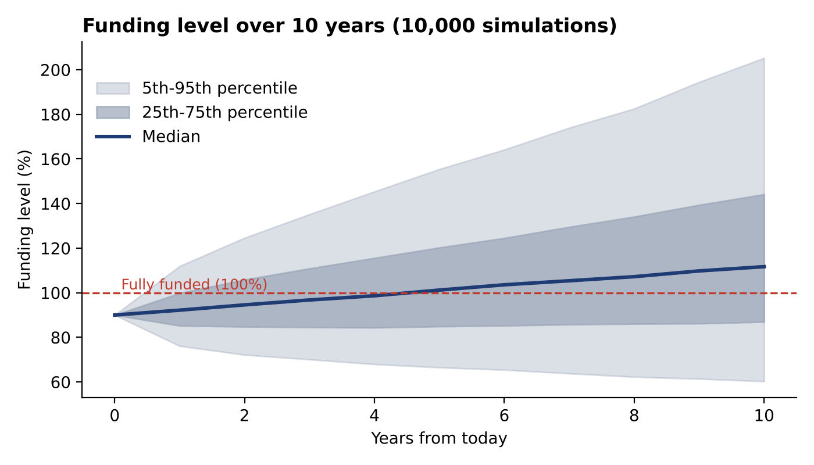
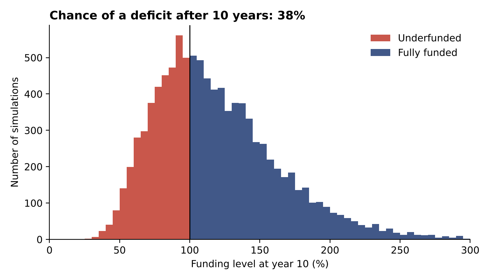
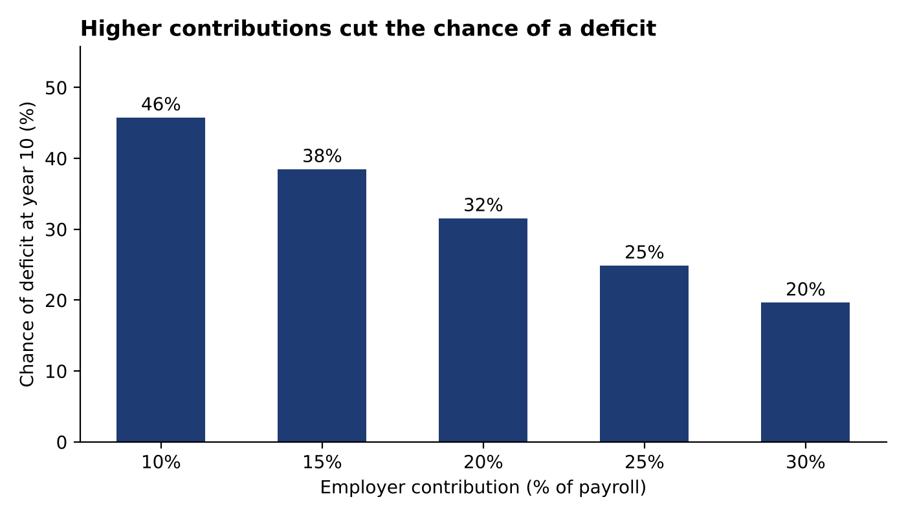

# Defined Benefit Pension Funding & Longevity Risk Model

**Can a company afford the pensions it has promised, and how much extra funding does it need to be safe?**

A Monte Carlo model of an illustrative 500-member defined benefit (DB) pension scheme in India. It values the scheme's liabilities with the Indian Individual Annuitant's Mortality Table (2012-15), simulates 10,000 possible futures for the fund's investments, and turns the results into funding recommendations.

**Author:** Anushka Singh | MA Actuarial Economics, Madras School of Economics | **Built with:** Python, Excel

> **Illustrative project.** The 500 members are synthetic and the economic assumptions are my own (listed in Section 6). The method is real. The client is not. New to pensions? See the [glossary](#glossary) at the end.

---

## At a glance

| | |
|---|---|
| **The situation** | The scheme owes **₹392.0 crore** in pensions but holds assets worth **₹352.8 crore**, so it is 90% funded and ₹39.2 crore short |
| **The risk** | After 10 years there is a **38.5% chance the scheme is still underfunded**. In the worst 5% of outcomes it holds only 60% of what it owes |
| **What matters most** | The discount rate moves liabilities the most (about ₹99 crore up or ₹75 crore down for a 1 point change), then employer contributions, then members living longer (+₹14.2 crore) |
| **The recommendation** | Raise employer contributions towards **25% of payroll**, which cuts the chance of a deficit from 38.5% to 24.9%, and agree a funding trigger plan for the bad outcomes that contributions alone cannot remove |

---

## 1. The business problem

A mid-sized Indian employer runs a closed DB pension scheme. There are 500 active members aged 30 to 59. Each retires at 60 and receives a pension of 1/60 of final salary for every year of service. The fund is invested in the market, so it can rise or fall. The scheme's trustees and finance director ask four questions:

1. How likely is the scheme to be underfunded in 10 years?
2. How much would it hurt if members live longer than expected?
3. How much extra should the employer contribute?
4. Which assumption should we worry about most?

## 2. Objective

Quantify the scheme's funding risk over 10 years, test how much longevity, contributions and the discount rate change it, and turn the results into recommendations that a non-specialist can act on.

---

## 3. Key findings

### 3.1 Funding outlook (base case: 15% employer contributions)

| Measure | Result |
|---|---|
| Liabilities today | ₹392.0 crore (6.1 times the yearly salary bill of ₹64.0 crore) |
| Assets today | ₹352.8 crore (90% funded) |
| Life expectancy at 60 (IAI annuitant table) | 24.0 years |
| Median funding level after 10 years | 111.7% |
| Worst 5% of outcomes | 60.3% |
| **Probability of a funding deficit after 10 years** | **38.5%** |

The scheme is more likely than not to recover, but there is a large tail of bad outcomes.





### 3.2 Longevity: what if members live 2 years longer?

| | Base | Members live 2 years longer |
|---|---|---|
| Liabilities | ₹392.0 crore | +3.6% (about +₹14.2 crore) |
| Median funding level | 111.7% | 107.1% |
| Worst 5% of outcomes | 60.3% | 57.8% |
| Chance of a deficit | 38.5% | 42.8% |

### 3.3 Contributions: how much does extra funding help?

| Employer contribution (% of payroll) | Median funding level | Worst 5% | Chance of a deficit |
|---|---|---|---|
| 10% | 104.3% | 54.6% | 45.8% |
| 15% (base) | 111.7% | 60.3% | 38.5% |
| 20% | 119.1% | 65.7% | 31.6% |
| 25% | 126.6% | 71.2% | 24.9% |
| 30% | 134.1% | 76.5% | 19.7% |

Each extra 5 points of payroll costs about **₹3.2 crore a year** on today's payroll and cuts the chance of a deficit by about 5 to 7 points.



### 3.4 Discount rate: the biggest swing factor

| Discount rate | Change in liabilities |
|---|---|
| 6% | +25.3% (about +₹99 crore) |
| **7% (base)** | – |
| 8% | -19.1% (about -₹75 crore) |

A one point change in the discount rate moves liabilities by far more than two extra years of life does.

---

## 4. Recommendations

1. **Raise employer contributions towards 25% of payroll.**
   *Evidence:* the chance of a deficit falls from 38.5% (at 15%) to 24.9% (at 25%). *Cost:* about ₹3.2 crore a year for each 5 points on today's payroll.

2. **Do not rely on contributions alone. Agree a trigger plan.**
   *Evidence:* even at 30% contributions, about 1 in 5 outcomes ends in deficit and the worst 5% still reach only 76.5%. *Action:* agree in advance what happens if funding falls below a set level (for example, a review and a top-up payment), so the trustees are not deciding in a crisis.

3. **Agree a prudent discount rate and review it every year.**
   *Evidence:* a 1 point change moves liabilities by ₹75 to ₹99 crore, the largest swing in the model. *Next step, not modelled here:* consider matching the fund's assets to the pension payments, so that interest rate moves hit assets and liabilities together.

4. **Monitor longevity and keep a margin for it.**
   *Evidence:* two extra years of life add about ₹14.2 crore to liabilities and 4.3 points to the deficit chance. The effect is smaller than the discount rate, but it only ever adds cost if members live longer, so compare actual member experience with the mortality table regularly.

---

## 5. How the model works

```
Synthetic members --> IAI mortality table --> Liabilities (what the scheme owes, in today's money)
                                                      |
Random investment returns (10,000 paths) ---> Funding level = assets / liabilities
                                                      |
              Scenarios: longer lives, higher contributions, different discount rate
```

1. **Members.** 500 synthetic active members aged 30 to 59, with salaries around ₹12 lakh and service from age 22. Each earns a yearly pension of 1/60 of final salary per year of service, payable from age 60.
2. **Mortality.** Annual death probabilities q(x) come from the Indian Individual Annuitant's Mortality Table (2012-15), ages 20 to 115. The chance of surviving t years is built from these rates.
3. **Liabilities.** The expected pension in each future year is the pension amount multiplied by the chance the member is alive. These are added across members and discounted at 7% to give today's liability.
4. **Asset simulation.** Each of 10,000 paths rolls assets forward: `assets(next year) = assets × (1 + random return) + contributions − pensions paid`. Returns are lognormal with an 8% mean and 12% volatility.
5. **Funding level.** Assets divided by liabilities, recorded each year. The share of paths ending below 100% is the deficit probability.
6. **Scenarios.** The model is re-run with members living 2 years longer (they follow the mortality of people 2 years younger), with contributions from 10% to 30% of payroll, and with discount rates of 6% and 8%.

## 6. Assumptions (all editable in Section 1 of the code)

| Assumption | Value |
|---|---|
| Members | 500 (synthetic) |
| Retirement age | 60 |
| Pension accrual | 1/60 of final salary per year of service |
| Salary growth | 6% a year |
| Discount rate | 7% |
| Pension increases | 0% |
| Starting funding level | 90% |
| Asset return / volatility | 8% / 12% a year |
| Base employer contribution | 15% of payroll |
| Horizon / simulations | 10 years / 10,000 |
| Longevity shock | Mortality of people 2 years younger |
| Mortality table | Indian Individual Annuitant's Mortality Table (2012-15), Institute of Actuaries of India |

The results depend on these choices, so treat them as illustrations of the method, not as predictions.

## 7. Validation

- **Reperformance in Excel.** One member (age 45, salary ₹12 lakh, 23 years of service) is valued in `DB_Pension_Reperformance_Check.xlsx` using live formulas and the IAI table. The Excel liability matches the Python result to the paisa: **₹73,15,529.96**.
- **Independent survival check.** The 15-year survival probability for the same member was recomputed directly from the table as a product of (1 − q), and agrees with the model to 13 decimal places.
- **Sensible outputs.** Life expectancy at 60 of 24.0 years, a longevity shock that raises liabilities, and a deficit probability that falls as contributions rise all move in the expected direction.

## 8. Limitations

- **Liabilities are an expected value.** Only asset returns are random. Interest rates, inflation and salary growth are fixed, so interest rate risk appears only as the discount-rate sensitivity.
- **Liabilities include future service.** Each member's full projected pension is valued, so contributions fund part of the liability. A real valuation would separate benefits already earned from those still to be earned.
- **The scheme is closed.** There are no new joiners, leavers, early retirements, death-in-service benefits or spouse pensions.
- **Mortality is fixed.** There is no future improvement in longevity beyond the 2-year shock, and no uncertainty in the mortality table itself.
- **Pensions are not indexed.** Increases in payment are set to 0%.
- **Returns are lognormal.** Real markets have fatter tails and volatility that changes over time.
- **The members are synthetic**, so results are illustrative and should not be read as a valuation of any real scheme.

**Possible extensions:** stochastic interest rates and inflation, mortality improvement (for example with a Lee-Carter model), an asset-liability matching strategy, and GARCH returns to capture changing volatility.

## 9. Skills demonstrated

| Skill | Where it shows |
|---|---|
| Stochastic modelling | 10,000-path Monte Carlo simulation of fund assets |
| Actuarial valuation | Liabilities from the IAI mortality table, discounted to today |
| Scenario and sensitivity analysis | Longevity shock, contribution levels, discount rate |
| Model validation | Excel reperformance, independent survival check, sense checks |
| Communicating to non-specialists | Answer-first summary, charts, recommendations in plain language |
| Tools | Python (NumPy, pandas, Matplotlib), Excel with live formulas |

## 10. How to run

```bash
pip install -r requirements.txt
python db_pension_full.py
```

On Google Colab, upload `db_pension_full.py` and run `!python db_pension_full.py`.

The script saves its charts, an Excel check and the member list in a folder called `pension_outputs`. The random seeds are fixed, so the results above should reproduce.

**Repository contents**

| File | What it is |
|---|---|
| `db_pension_full.py` | The complete model, charts and Excel check |
| `DB_Pension_Reperformance_Check.xlsx` | One member's liability worked out with live Excel formulas |
| `chart1_funding_fan.png`, `chart2_year10_distribution.png`, `chart3_contributions.png` | Result charts |
| `requirements.txt` | Python libraries needed |

**Data source:** mortality rates are from the *Indian Individual Annuitant's Mortality Table (2012-15)*, published by the Institute of Actuaries of India, effective 1 April 2021. All other data (members, salaries, assets) are synthetic.

## Glossary

- **Defined benefit (DB) scheme:** a pension where the employer promises a fixed pension for life, so the employer carries the risk if the money runs short.
- **Liabilities:** the total pensions the scheme owes, valued in today's money.
- **Funding level:** assets divided by liabilities. 90% means 90 rupees held for every 100 owed. Below 100% is a deficit.
- **Monte Carlo simulation:** repeating the same test thousands of times with random changes, then looking at the spread of results.
- **Mortality table:** a table of how likely people are to die at each age. It decides how many years pensions are paid.
- **Longevity risk:** the risk that people live longer than expected, so pensions are paid for more years.
- **Discount rate:** the rate used to turn pensions owed in the future into their value today.
- **Percentile:** the "worst 5%" figure is the 5th percentile, meaning 95% of outcomes were better than this.

